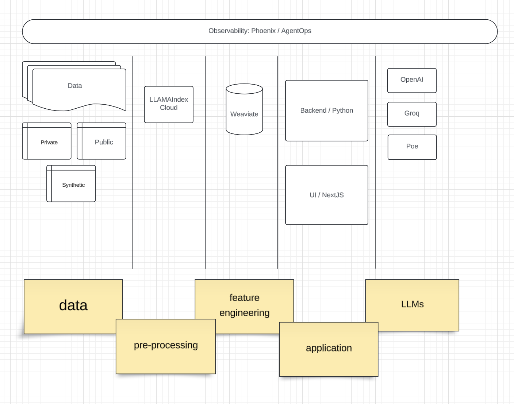

# PillPoe Bot

This project won 2nd place at Poe Hackathon ORGANIZED BY {AGI House](https://agihouse.org) on 17th Aug 2024.

Hashtags: #poe #modal #weaviate #fireworks #llamaIndex #arize #hackpro_sako

AI Assistant for Drug interactions.

Using Natural Language input:
- extract clinical conditions and drugs
- analyze both for interactions from authoritative sources
- present findings

## Social Posts
- [Demo](https://share.zight.com/p9uonyAl)
- [Winners interview](https://share.zight.com/p9uonyAl)

- [Poe Linkedin Post](https://www.linkedin.com/posts/poe-platform_announcing-our-latest-hackathon-winners-activity-7233925102327754753-Kb7a)
- [Poe X Post](https://x.com/poe_platform/status/1828155999116763343)
- [Sako Linkedin Post](https://www.linkedin.com/posts/sakom_h26-poe-modal-activity-7231672585304821760-a8PF)


## Team
- [Ritu Raj Tiwari](https://www.linkedin.com/in/riturajtiwari)
- [Danielh Carranza](https://www.linkedin.com/in/danielhcarranza)
- [Sako M](https://www.linkedin.com/in/sakom)


# Architecture

The system is composed of the following key components:

- **National Library of Medicine (NLM):** Provides a comprehensive medical data source.
- **RxNorm for Drugs Database:** Offers standardized nomenclature for medications.
- **ICD-10 for Conditions Database:** Supplies a structured format for diseases and health conditions.

### LLAMAIndex Cloud

- Processes and organizes the data from NLM, RxNorm, and ICD-10, making it searchable and accessible.

### Vector Databases

- **Weaviate:** A vector database for storing and retrieving medical data using embeddings.
  
### Backend (Python/Modal)

- The core processing unit, written in Python, handles requests from the UI and manages interactions between services, databases, and APIs. It is scalable and efficient, potentially leveraging serverless architecture via Modal.

### User Interface (NextJS)

- A responsive UI built with NextJS that allows users to input queries and interact with the system's features.

### Poe Server & Poe UI

- Handles specific functionalities related to query processing, offering an additional interface for specialized requests.

### OpenAI Integration

- Enhances the system by providing advanced natural language processing and response generation capabilities.

### Phoenix/Observability

- Monitors system performance, detects anomalies, and provides operational insights to ensure smooth functioning.

## Flow Summary

1. **Data Collection:** Information from NLM, RxNorm, and ICD-10 is ingested into the system.
2. **Indexing & Storage:** LLAMAIndex Cloud processes this data and stores it in vector database Weaviate for efficient retrieval.
3. **Backend Processing:** The Python-based backend manages requests, coordinates with databases, and utilizes OpenAI for natural language understanding.
4. **User Interaction:** Users interact with the system via the NextJS UI, inputting queries that the backend processes and returns relevant information.
5. **Observability:** Phoenix/Observability tools monitor the system’s health and performance, ensuring reliability and efficiency.



# Demo


# Install
Set secrets in .env file under /backend:
```
LLAMA_CLOUD_API_KEY=x
OPENAI_API_KEY=x
PHOENIX_API_KEY=x
WEAVIATE_CLUSTER_URL=x
WEAVIATE_API_KEY=x
```

## Backend
Run in Modal:
```
 modal serve deploy.py
```

## Frontend
Run frontend locally:
```
yarn install
yarn dev
```


# Slides
[Slides](./slides/PillPoeBot.pdf)
